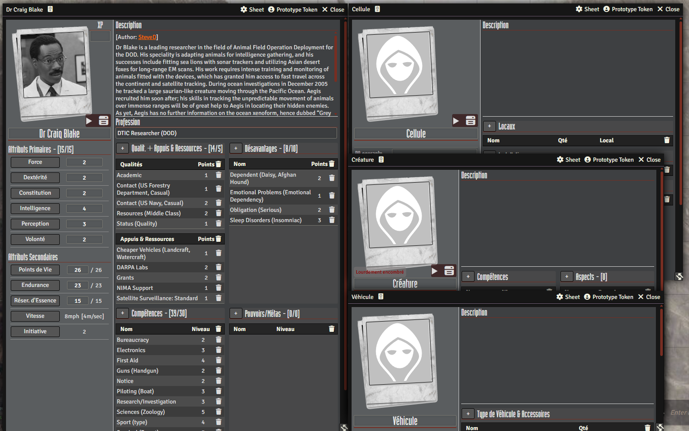
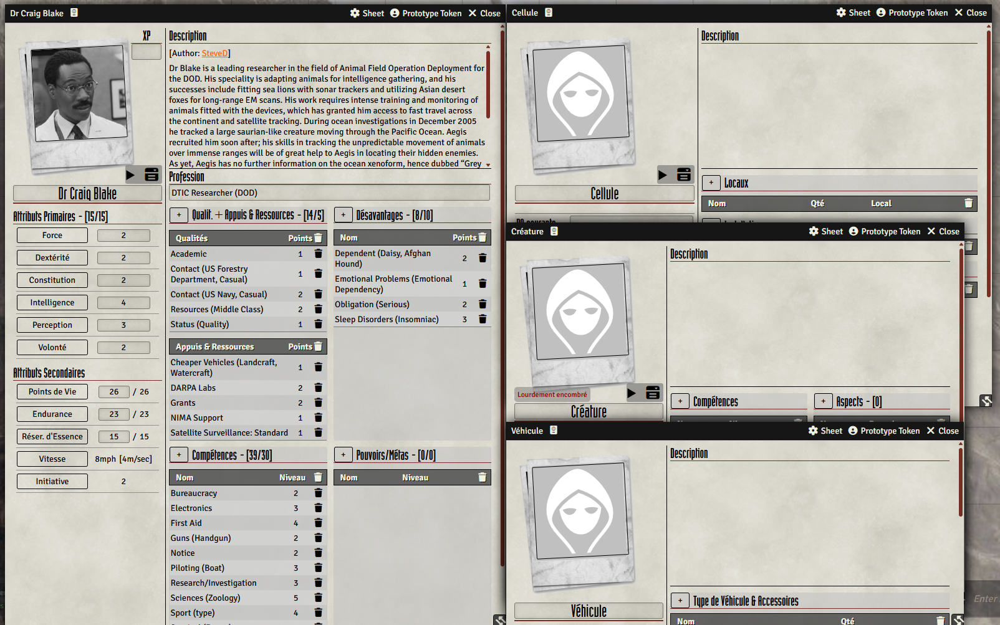

# UNISYSTEMCINEMATIC BY MMFO

A fanmade FoundryVTT system to play AFMBE, Armageddon, Terra Primate, WitchCraft, & Conspiracy X 2.0 by Eden Studios.

(No Eden Studios IP infringement).

Just select your game (All Flesh Must Be Eaten, Armageddon, Terra Primate, WitchCraft, or Conspiracy X 2.0) in the Foundry VTT game settings.

You can purchase the rulebooks from their website https://www.edenstudios.net/ or from DrivethruRPG at
https://www.drivethrurpg.com/fr/publisher/10/eden-studios

Done after DogBoneZone's:

A fanmade FoundryVTT system to play All Flesh Must Be Eaten by Eden Studios. This system is unaffiliated with Eden Studios 
and uses no trademarked content or media from any of the games or rulebooks. The system merely provides a framework to play the game.
I highly encourage all users to buy or download a copy of the AFMBE Core Rulebook and many content additions. You can find some quick
links to purchase this content further below.

All rights for the game belong to Eden Studios and their affiliated partners. Eden Studios makes no representation or warranty as to
the quality, viability, or suitability for purpose of this product.

You can purchase the rulebooks from their website https://www.edenstudios.net/ or from DrivethruRPG at
https://www.drivethrurpg.com/browse/pub/10/Eden-Studios/subcategory/57_60/All-Flesh-Must-Be-Eaten

****

<figure>
    
    <figcaption>Dark Mode (Default Setting)</figcaption>
</figure>

****

<figure>
    
    <figcaption>Light Mode (Enabled through System Settings)</figcaption>
</figure>
